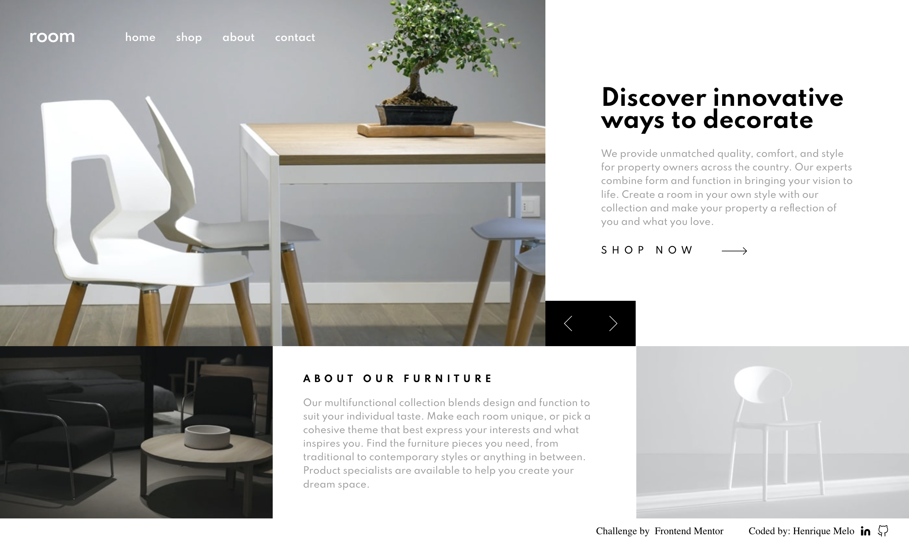
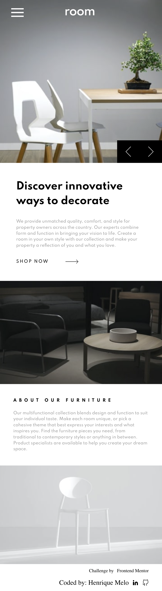

# Room homepage

This is a solution to the [Room homepage challenge on Frontend Mentor](https://www.frontendmentor.io/challenges/room-homepage-BtdBY_ENq). Frontend Mentor challenges help you improve your coding skills by building realistic projects. 

## Table of contents

- [Room homepage](#room-homepage)
  - [Table of contents](#table-of-contents)
  - [Overview](#overview)
    - [The challenge](#the-challenge)
    - [Screenshot](#screenshot)
    - [Links](#links)
  - [My process](#my-process)
    - [Built with](#built-with)
    - [What I learned](#what-i-learned)
    - [Continued development](#continued-development)
  - [Author](#author)

## Overview

### The challenge

Users should be able to:

- View the optimal layout for the site depending on their device's screen size
- See hover states for all interactive elements on the page
- Navigate the slider using either their mouse/trackpad or keyboard

### Screenshot




### Links

- Solution URL: [Add solution URL here](https://github.com/HenriqueAmorim20/room)
- Live Site URL: [Add live site URL here](https://melohenrique-room.netlify.app/)

## My process

### Built with

- Semantic HTML5 markup
- CSS custom properties
- Flexbox
- Mobile-first workflow
- [VueJS](https://vuejs.org/) - JS library
- [Nuxt.js](https://nuxtjs.org/) - VueJS framework
- [Vuetify](https://vuetifyjs.com/) - Material Design Framework

### What I learned

I learned i lot about clamp and responsive width/font-size, also a lot of layout position practise.

code i'm proud of:
```css
.desc-section-btn {
  display: flex;
  align-items: center;
  text-transform: uppercase;
  cursor: pointer;
  color: var(--Black);
  font-weight: 500;
  font-size: clamp(0.6rem, 1vw, 0.9rem);
  letter-spacing: 0.5vw;
  transition: opacity 0.5s ease;
}
```
```js
changeContent(i) {
  this.index += i;
  if (this.index < 0) this.index = this.heroes.length - 1;
  if (this.index === this.heroes.length) this.index = 0;
},
}
```

### Continued development

I will continue this project and implement another pages, practising the layout pattern and design.
## Author

- Website - [Henrique Melo](https://www.melohenrique.com)
